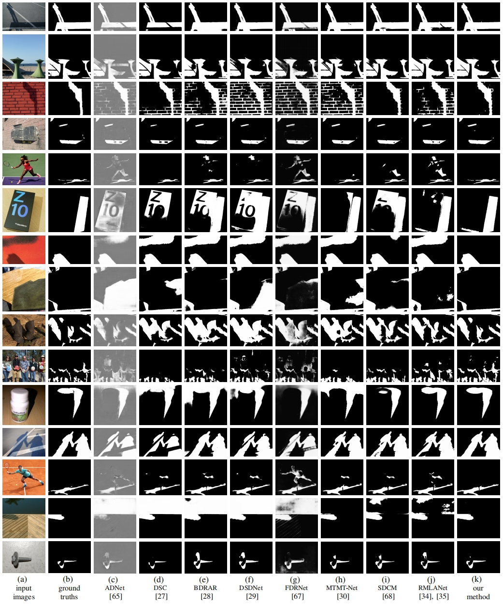

# AdapterShadow
Source code for our paper ["AdapterShadow: Adapting Segment Anything Model for Shadow Detection"](https://arxiv.org/abs/2311.08891). 

# How to evaluate ?
```
python pl_test_simple.py -net sam -exp_name sbu -npts 5 -backbone b1 -plug_image_adapter -all -freeze_backbone -use_neg_point -sample grid -grid_out_size 16
```
Before running, please specify the corresonding dataset name by:
-dataset_name sbu (or -dataset_name cuhk)

How to obtain the datasets:
(1) for SBU, UCF, CUHK and ISTD, please refer to:
https://github.com/LeipingJie/SAMShadow

(2) for SBU_New, please refer to:
https://github.com/hanyangclarence/SILT

You can find our code, results, models at:
[Code & Results](https://drive.google.com/drive/folders/1vpETQm5TMFkC7frHi8y83q5hxxq4vY3M?usp=sharing)

## Visual Comparison


If you find this project useful for your research, please cite:
```
@misc{jie2023adaptershadow,
      title={AdapterShadow: Adapting Segment Anything Model for Shadow Detection}, 
      author={Leiping Jie and Hui Zhang},
      year={2023},
      eprint={2311.08891},
      archivePrefix={arXiv},
      primaryClass={cs.CV}
}
```
